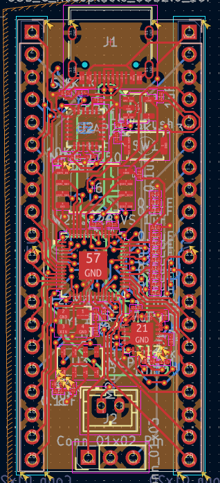
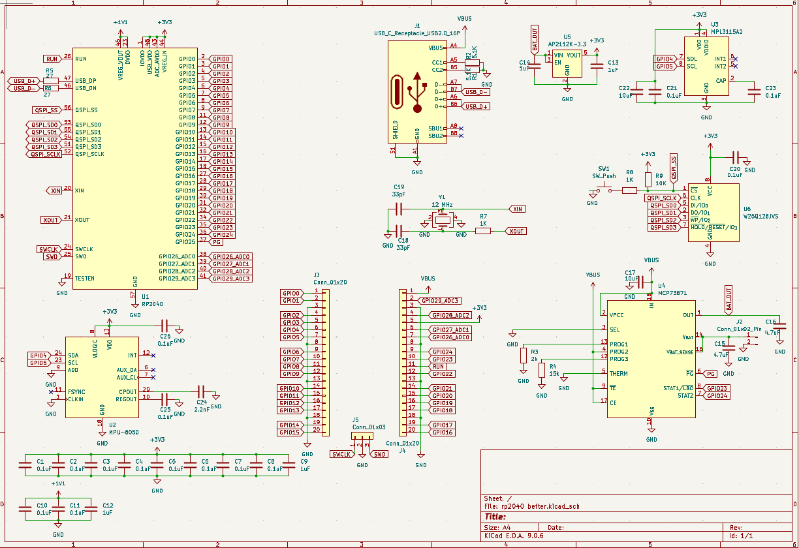

# RP2040-Custom

A compact, battery-powered **RP2040 development board** with USB-C, on-board charging, and integrated motion and environmental sensors.

---

## Features
- RP2040 microcontroller  
- USB-C connectivity  
- Li-ion battery support with load sharing  
- 6-axis IMU (gyro + accelerometer)  
- Barometric pressure / altitude sensor  

---

## PCB
**3D View**  

**PCB Layout**  

**Schematic**  

---

## Bill of Materials (BOM)

| Part | Cost | Link |
|----|----|----|
| Custom PCB | $110.82 | — |
| Pin Headers | $3.46 | https://www.aliexpress.com/item/4000873858801.html |
| 600 mAh 3.7 V Li-ion Battery (503040, JST-PH) | $14.18 | https://www.aliexpress.com/item/1005008850455581.html |
| Total: | $129.67 CAD | $94.13 USD
